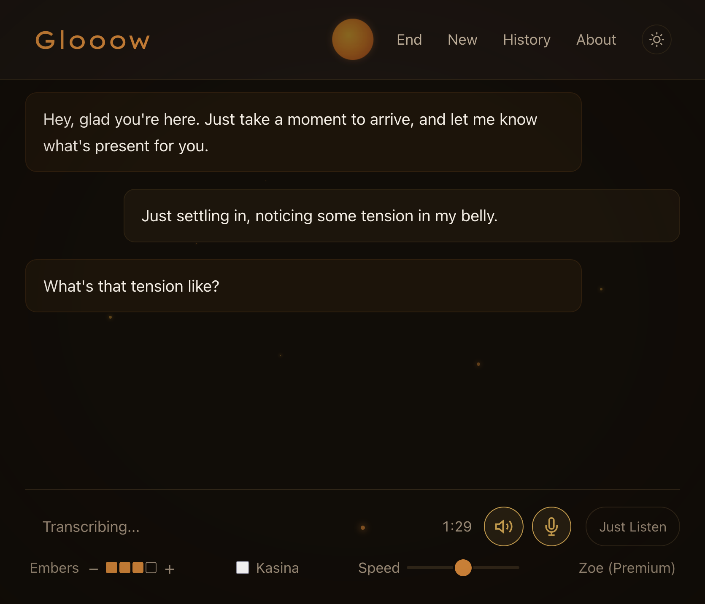

# glooow

your voice is an overpowered and underrated tool for meditation and inner work.

**glooow** is a meditation facilitator that listens and responds to your voice. it can be a partner for somatic exploration, parts work, and spaced noting. it uses your mic for voice input, whisper.cpp for speech recognition, an LLM to guide you, and speaks using text-to-speech.

glooow works on macOS, Linux, and Windows. choose your LLM — run fully local and private with ollama, use a claude subscription (may draw from extra-use credits as per new ToS), or connect any API provider (anthropic, openai, openrouter, venice). all providers are configurable from the settings page. the app will also help you set up text-to-speech if necessary.



## what it does

glooow has two modes: exploration and noting.

**exploration**: this is a dyadic meditation format where the meditator speaks about what they are experiencing in the moment and the facilitator asks brief questions to help the meditator explore. 

in this mode, you optionally set an intention and then mix and match **attention focuses** (body, emotions, parts work) with **vibes** (playful, compassionate, loving, spacious, effortless, feel-good). presets give you quick starting points, or you can build your own style. there's a directiveness slider so you can dial in how much guidance you want. in my personal experience, this sort of exploration has been helpful in experiencing jhana states if approached with enough openheartedness.

thanks to [Maija Haavisto](https://lovingawakening.net/) and [Jhourney](https://www.jhourney.io/) for guiding me in similar practices.

**noting**: you specify what participants you'd like, if any — AIs, fixed phrases, or sound effects. then starting with you, each participant notes a sensation in their "awareness" (ideally 1–2 words) or plays their fixed phrase or sound. yes, AIs noting their experience seems kind of silly, but I've actually found it helpful to observe the mental and somatic processes that happen in the cycle of resting -> hearing my cue -> observing -> speaking. if there are no other participants, it'll just briefly introduce the method and then record what you note.

thanks to [Vince Horn](https://www.buddhistgeeks.org/) and again to [Jhourney](https://www.jhourney.io/) for inspiration.

## getting started

### download the app

grab the latest release for your platform below, or from [releases](https://github.com/akrusz/glooow/releases):

| platform | download |
|----------|----------|
| **macOS** | [`Glooow-0.10.2-macOS.dmg`](https://github.com/akrusz/glooow/releases/download/v0.10.2/Glooow-0.10.2-macOS.dmg) — open the DMG, drag Glooow to Applications |
| **Windows** | [`Glooow-0.10.2-Windows.exe`](https://github.com/akrusz/glooow/releases/download/v0.10.2/Glooow-0.10.2-Windows.exe) — run the installer |
| **Linux** | [`Glooow-0.10.2-Linux.AppImage`](https://github.com/akrusz/glooow/releases/download/v0.10.2/Glooow-0.10.2-Linux.AppImage) — `chmod +x`, double-click or run from terminal |

all settings (LLM provider, voice, whisper model, display) are configurable from the settings page inside the app. whisper models download automatically on first launch. the app checks for updates on startup and will prompt you when a new version is available.

### platform notes

- **macOS**: TTS uses the `say` command with access to all system voices. You can download better system voices by going to System Settings > Accessibility > Spoken Content, click the dropdown next to System Voice, select Manage Voices, and download Enhanced or Premium voices.
- **windows**: if using browser mode, for best voice quality use Edge — it has access to Microsoft's natural voices (Ava, Jenny) through speechSynthesis.
- **linux**: for server-side TTS, install piper-tts and set the TTS Engine to Piper on the settings page. otherwise TTS falls back to browser speechSynthesis. Note that some browsers don't have built in speech synthesis.

## tips

- if speech recognition feels slow, try the `base` whisper model (faster, less accurate).
- say something like "hold on a bit" during a session to enter silence mode. say "come back" or similar to resume.
- say "mute" to immediately turn off the microphone. click the mic button to resume.
- click the orb in the nav bar to enter kasina gazing mode during a session. click away from it to exit.
- the ember controls add floating particles. each level doubles the count and increases the size.
- click the voice name in the controls bar to open a voice/speed picker.
- sessions auto-save as JSON and plain text, with a short LLM-generated summary.
- you can continue any past session or access the saved sessions folder from the history page.
- the AI can hold silence when requested and gently check in if you're quiet for a while. adjust timing in settings.
- one running copy of glooow can be made accessible to anyone on your local network by setting network access mode to "LAN Access" in settings
- 🥚 there are a few easter eggs 🥚

## running from source

```bash
git clone https://github.com/akrusz/glooow.git
cd glooow
./scripts/start.sh          # bootstraps on first run, then launches
```

on first run, `start.sh` installs dependencies, creates a Python environment, and writes a default config. configure your LLM provider and other settings in the web UI. requires python 3.10+ and [uv](https://docs.astral.sh/uv/) (installed automatically if missing).

there are also double-click launchers in `scripts/` (`Start-Mac.command`, `Start-Windows.bat`, `Start-Linux.desktop`).

### one-line install

```bash
# macOS/Linux
curl -fsSL https://raw.githubusercontent.com/akrusz/glooow/main/scripts/setup.sh | bash
```
```bash
# Windows (PowerShell)
irm https://raw.githubusercontent.com/akrusz/glooow/main/scripts/setup.ps1 | iex
```

### nix

if you have nix with flakes enabled:

```bash
git clone https://github.com/akrusz/glooow.git
cd glooow
nix develop                             # browser-only (lighter): nix develop .#browser
./scripts/start.sh                      # auto-bootstraps config and launches
```

the flake provides portaudio, ffmpeg, python, uv, and GTK/WebKit2 (for pywebview) via the nix binary cache. python packages are installed via uv into a local venv on first entry.

## building

release builds are automated via GitHub Actions — creating a release tagged `vX.X.X` triggers builds for all three platforms and attaches the artifacts. see [docs/building.md](docs/building.md) for manual build instructions.
